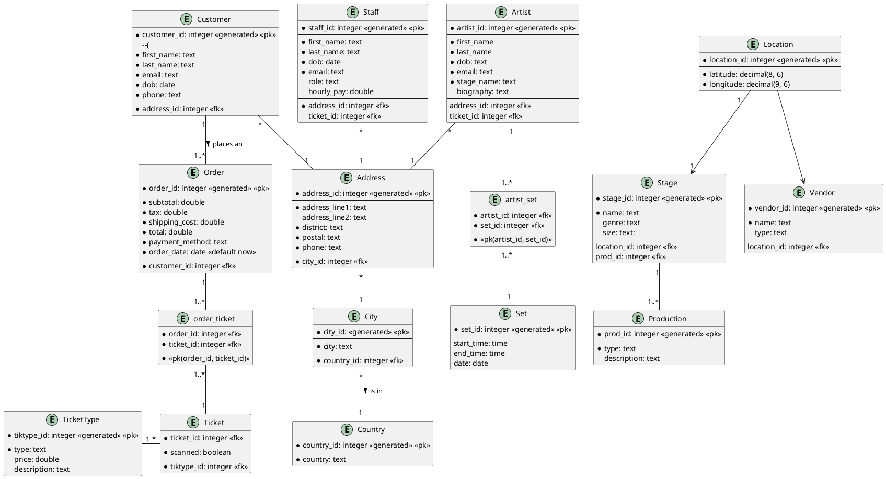

```plantuml
@startuml

entity Order {
* order_id: integer <<generated>> <<pk>>
--
* subtotal: double
* tax: double
* shipping_cost: double
* total: double
* payment_method: text
* order_date: date <<default now>>
--
* customer_id: integer <<fk>>
}

entity Customer {
* customer_id: integer <<generated>> <<pk>>
--(
* first_name: text
* last_name: text
* email: text
* dob: date
* phone: text
--
* address_id: integer <<fk>>
}

entity Ticket {
* ticket_id: integer <<fk>>
--
* scanned: boolean
--
* tiktype_id: integer <<fk>>
}

entity Staff {
* staff_id: integer <<generated>> <<pk>>
--
* first_name: text
* last_name: text
* dob: date
* email: text
  role: text
  hourly_pay: double
--
* address_id: integer <<fk>>
ticket_id: integer <<fk>>
}

entity Stage {
* stage_id: integer <<generated>> <<pk>>
--
* name: text
genre: text
size: text:
__
location_id: integer <<fk>>
prod_id: integer <<fk>>
}

entity Artist {
* artist_id: integer <<generated>> <<pk>>
--
* first_name
* last_name
* dob: text
* email: text
* stage_name: text
 biography: text
--
 address_id: integer <<fk>>
 ticket_id: integer <<fk>>
}

entity Production {
* prod_id: integer <<generated>> <<pk>>
--
* type: text
description: text
}

entity Set {
* set_id: integer <<generated>> <<pk>>
--
  start_time: time
  end_time: time
  date: date
}

entity Vendor {
* vendor_id: integer <<generated>> <<pk>>
--
* name: text
type: text
--
location_id: integer <<fk>>
}

entity Address {
* address_id: integer <<generated>> <<pk>>
--
* address_line1: text
 address_line2: text
* district: text
* postal: text
* phone: text
--
* city_id: integer <<fk>>
}

entity City {
* city_id: <<generated>> <<pk>>
--
* city: text
--
* country_id: integer <<fk>>
}

entity Country {
* country_id: integer <<generated>> <<pk>>
--
* country: text
}

entity TicketType {
* tiktype_id: integer <<generated>> <<pk>>
--
* type: text
 price: double
 description: text
}

entity order_ticket {
* order_id: integer <<fk>>
* ticket_id: integer <<fk>>
--
* <<pk(order_id, ticket_id)>>
}

entity artist_set {
* artist_id: integer <<fk>>
* set_id: integer <<fk>>
--
* <<pk(artist_id, set_id)>>
}

entity Location {
    * location_id: integer <<generated>> <<pk>>
    --
    * latitude: decimal(8, 6)
    * longitude: decimal(9, 6)
}


Customer "1" -- "1..*"Order: > places an
Order "1" -- "1..*" order_ticket
order_ticket "1..*" -- "1" Ticket
TicketType "1" - "*" Ticket
Artist "*" -- "1" Address
Staff "*" -- "1" Address
Customer "*" -- "1" Address
Address "*" -- "1" City
City "*" -- "1" Country: is in >
Artist "1" -- "1..*" artist_set
artist_set "1..*" -- "1 " Set
Stage "1" -- "1..*" Production
Location "1    " --> "1"Stage
Location --> Vendor 


@enduml
```